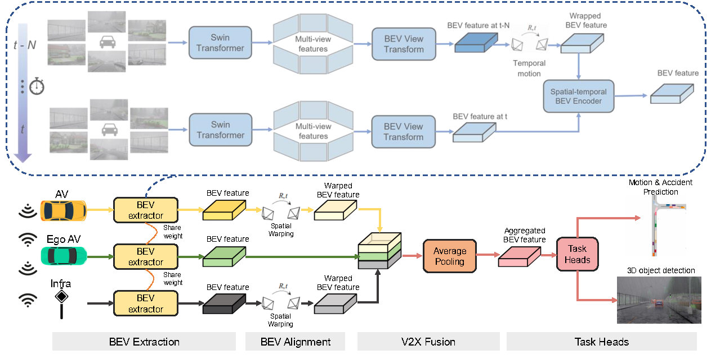

# DeepAccident

The official implementation of the paper [DeepAccident: A Motion and Accident Prediction Benchmark for V2X Autonomous Driving]("https://arxiv.org/pdf/2304.01168).
 
[//]: # (## News)

[//]: # (* **2022.07.20:** We release the code and models of DeepAccident.)

[//]: # (## Model Zoo)

[//]: # (|Method | mAP      | NDS     | IoU &#40;Map&#41; | IoU &#40;Motion&#41; | VPQ | Model |)

[//]: # (|:--------:|:----------:|:---------:|:--------:|:-------------:|:-----:|:-------:|)

[//]: # (| [**DeepAccident-Tiny**]&#40;configs/bevdet/bevdet-sttiny.py&#41;       | 32.1 | 46.6 | 48.7 | 38.7 | 33.3 | [Google Drive]&#40;https://drive.google.com/file/d/1S2o8v6YFkeHMuJIpw-SWNDGySacH1xCV/view?usp=sharing&#41;)

[//]: # (| [**DeepAccident-Small**]&#40;configs/bevdet4d/bevdet4d-sttiny.py&#41; | 35.2 | 49.5 | 51.7 | 40.9 | 36.1 | [Google Drive]&#40;https://drive.google.com/file/d/1n0teAat6Qy_EeJdDfWcwm0x8FZ2wsAo9/view?usp=sharing&#41;)

## Installation
Please check [installation](docs/installation.md) for installation and [data_preparation](docs/data_preparation.md) for preparing the nuScenes dataset.

## Getting Started
Please check [getting_started](docs/getting_started.md) for training, evaluation, and visualization of DeepAccident.

## Task Visualization

[//]: # (![visualization]&#40;figs/First_video.mp4 "Results on nuScenes"&#41;)
<video width="100%" height="100%" controls>
  <source src="figs/First_video.mp4" type="video/mp4">
  Task Visualization.
</video>

<video width="100%" height=auto loop autoplay muted>
    <source src="figs/First_video.mp4" type="video/mp4">
    Task Visualization.
</video>


## V2XFormer for perception & prediction


## Acknowledgement
This project is mainly based on the following open-sourced projects: [BEVerse](https://github.com/zhangyp15/BEVerse), [Fiery](https://github.com/wayveai/fiery), [open-mmlab](https://github.com/open-mmlab).

## Bibtex
If this work is helpful for your research, please consider citing the following BibTeX entry.
```
@article{Wang_2023_DeepAccident,
  title = {DeepAccident: A Motion and Accident Prediction Benchmark for V2X Autonomous Driving},
  author = {Wang, Tianqi and Kim, Sukmin and Ji, Wenxuan and Xie, Enze and Ge, Chongjian and Chen, Junsong and Li, Zhenguo and Ping, Luo},
  journal = {arXiv preprint arXiv:2304.01168},
  year = {2023}
}
```

